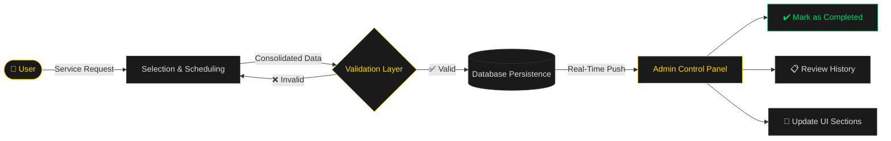

<div align="center">

<!-- ANIMATED HEADER -->


<!-- BADGES ROW -->
<p align="center">
  
  
  
  
  
</p>

<p align="center">
  
  
  
  
  
</p>

---

<!-- ANIMATED TYPING -->

[](https://git.io/typing-svg)

</div>

---

## 📌 Overview

**Software DT** is a high-performance web platform engineered for service management and process digitization. Built under strict production standards, its architecture fully decouples the client from the server — delivering elastic speed, security, and scalability.

> _Industrial-grade aesthetics. Dark-first UI. Gold-accented precision. Built to perform._

```
 ┌─────────────────────────────────────────────────────────────┐
 │                      SOFTWARE DT                            │
 │                                                             │
 │   [ CLIENT CLUSTER ]          [ ADMIN CLUSTER ]            │
 │   ┌───────────────┐           ┌───────────────┐            │
 │   │  Next.js App  │ ←──────→  │  Admin Panel  │            │
 │   │  (App Router) │           │ (Real-Time)   │            │
 │   └───────┬───────┘           └───────┬───────┘            │
 │           │  HTTP (Secure)            │                     │
 │   ┌───────▼───────────────────────────▼──────┐             │
 │   │         Node.js + Express Backend        │             │
 │   │         (Modular Services & Controllers) │             │
 │   └───────────────────┬──────────────────────┘             │
 │                       │                                     │
 │        ┌──────────────┴──────────────┐                     │
 │        ▼                             ▼                      │
 │   [ MongoDB ]                 [ PostgreSQL / MySQL ]        │
 └─────────────────────────────────────────────────────────────┘
```

---

## 🛠️ Unified Tech Stack

<table>
  <thead>
    <tr>
      <th>Layer</th>
      <th>Technology</th>
      <th>Purpose</th>
    </tr>
  </thead>
  <tbody>
    <tr>
      <td>🖥️ <strong>Frontend</strong></td>
      <td>React 18 + Next.js 15 (App Router)</td>
      <td>SSR, routing, and component architecture</td>
    </tr>
    <tr>
      <td>🔤 <strong>Language</strong></td>
      <td>TypeScript 5</td>
      <td>Type-safe, scalable codebase</td>
    </tr>
    <tr>
      <td>🎨 <strong>Styling</strong></td>
      <td>Tailwind CSS 3</td>
      <td>Utility-first responsive UI</td>
    </tr>
    <tr>
      <td>⚡ <strong>State</strong></td>
      <td>Zustand</td>
      <td>Lightweight global state, zero unnecessary re-renders</td>
    </tr>
    <tr>
      <td>🎭 <strong>UI/UX</strong></td>
      <td>Dark mode · <code>#FFD700</code> Gold · <code>#DCDCDC</code> Gainsboro</td>
      <td>High-end industrial aesthetic</td>
    </tr>
    <tr>
      <td>🔧 <strong>Backend</strong></td>
      <td>Node.js + Express</td>
      <td>Modular services and independent controllers</td>
    </tr>
    <tr>
      <td>🗄️ <strong>Database</strong></td>
      <td>MongoDB · PostgreSQL · MySQL</td>
      <td>Non-relational speed + relational integrity</td>
    </tr>
    <tr>
      <td>🐳 <strong>DevOps</strong></td>
      <td>Docker Alpine · AWS · Vercel · Git CI/CD</td>
      <td>Lightweight containers + continuous delivery</td>
    </tr>
  </tbody>
</table>

---

## 🔄 Appointment System — Operational Flow

The core engine processes bookings sequentially and cleanly, ensuring data integrity from the client all the way to the admin dashboard.



### Step-by-step

| # | Phase | Description |
|---|-------|-------------|
| 1️⃣ | **Selection & Scheduling** | Captures service requirements and consolidates booking data |
| 2️⃣ | **Database Persistence** | Transmits unified data via secure HTTP, validates before saving |
| 3️⃣ | **Real-Time Admin Panel** | Administrators see incoming appointments instantly — mark complete, review history, update UI |

---

## 🐳 Docker Infrastructure & Deployment

Software DT runs in isolated containers ensuring **identical behavior** between local development and cloud production servers.

### Development Environment

```dockerfile
# Node 20 Alpine — Lightweight & Fast
FROM node:20-alpine

WORKDIR /app
COPY package*.json ./
RUN npm install

COPY . .

# Hot Module Replacement — see changes instantly
EXPOSE 5173
CMD ["npm", "run", "dev", "--", "--host"]
```

```yaml
# docker-compose.dev.yml
services:
  frontend-dev:
    build:
      context: .
      dockerfile: Dockerfile.dev
    ports:
      - "5173:5173"
    volumes:
      - .:/app                    # HMR volume mount
      - /app/node_modules
    environment:
      - NODE_ENV=development
```

> 🔥 **Hot Module Replacement** — Volume mounts enable instant code reflection without container restarts.

---

### Production Environment — Multi-Stage Build

```dockerfile
# ── Stage 1: Build ──────────────────────────────────
FROM node:20-alpine AS builder

WORKDIR /app
COPY package*.json ./
RUN npm ci --omit=dev
COPY . .
RUN npm run build

# ── Stage 2: Serve ──────────────────────────────────
FROM nginx:alpine AS production

COPY --from=builder /app/.next/static /usr/share/nginx/html/_next/static
COPY --from=builder /app/out           /usr/share/nginx/html
COPY nginx.conf                        /etc/nginx/nginx.conf

EXPOSE 80
CMD ["nginx", "-g", "daemon off;"]
```

```nginx
# nginx.conf — SPA Routing Handler
server {
    listen 80;
    root /usr/share/nginx/html;
    index index.html;

    location / {
        try_files $uri $uri/ /index.html;   # SPA fallback
    }

    location /_next/static/ {
        expires 1y;
        add_header Cache-Control "public, immutable";
    }
}
```

---

## 🔒 Dual-Cluster Architecture & Security

```
┌─────────────────────────────────────────────────────────────┐
│                    SECURITY PERIMETER                       │
│                                                             │
│  ┌──────────────────┐        ┌──────────────────────────┐  │
│  │  CLIENT CLUSTER  │        │     ADMIN CLUSTER        │  │
│  │                  │        │                          │  │
│  │  • Public Routes │        │  • Protected Routes      │  │
│  │  • Auth Routes   │        │  • Real-Time Dashboard   │  │
│  │  • Booking Flow  │        │  • Operational Metrics   │  │
│  └────────┬─────────┘        └────────────┬─────────────┘  │
│           │                               │                 │
│           └──────────────┬────────────────┘                 │
│                          ▼                                  │
│              ┌───────────────────────┐                      │
│              │   AUTH MIDDLEWARE     │                      │
│              │  Role-Based Access    │                      │
│              │  JWT · Session Mgmt   │                      │
│              └───────────────────────┘                      │
└─────────────────────────────────────────────────────────────┘
```

| Feature | Details |
|---------|---------|
| 🏗️ **Layer Segregation** | Frontend and Backend fully decoupled. Admin Panel runs in its own cluster — no client traffic interference |
| 🔑 **Auth & Roles** | Robust authentication strictly separating public, auth, admin, and internal routes |
| 📊 **Real-Time Metrics** | Data aggregation components computing daily, monthly, and annual operational totals — instantly |

---

## 🚀 Getting Started

### Prerequisites

```bash
node  >= 20.x
npm   >= 10.x
docker >= 24.x
```

### Local Development (Docker)

```bash
# 1. Clone the repository
git clone https://github.com/your-org/software-dt-frontend.git
cd software-dt-frontend

# 2. Configure environment
cp .env.example .env.local

# 3. Launch with Docker (HMR enabled)
docker-compose -f docker-compose.dev.yml up --build

# → App running at http://localhost:5173
```

### Local Development (Native)

```bash
npm install
npm run dev
# → http://localhost:3000
```

### Production Build

```bash
# Build & serve via Docker
docker build -t software-dt-frontend .
docker run -p 80:80 software-dt-frontend

# Or deploy to Vercel
vercel --prod
```

---

## 📁 Project Structure

```
software-dt-frontend/
├── 📁 app/                      # Next.js App Router
│   ├── 📁 (public)/             # Public-facing routes
│   │   ├── page.tsx             # Landing page
│   │   └── booking/             # Appointment flow
│   ├── 📁 (admin)/              # Admin cluster routes
│   │   ├── dashboard/           # Real-time control panel
│   │   ├── appointments/        # Booking management
│   │   └── metrics/             # Operational analytics
│   └── 📁 (auth)/               # Authentication routes
├── 📁 components/               # Reusable UI components
│   ├── 📁 ui/                   # Base design system
│   └── 📁 dashboard/            # Admin-specific widgets
├── 📁 stores/                   # Zustand state stores
├── 📁 lib/                      # Utilities & API clients
├── 📁 types/                    # TypeScript definitions
├── 📁 public/                   # Static assets
├── Dockerfile                   # Production multi-stage
├── Dockerfile.dev               # Development with HMR
├── docker-compose.dev.yml
└── nginx.conf
```

---

## 🎨 Design System

> Industrial high-end aesthetic · Dark-first · Precision-accented

| Token | Value | Usage |
|-------|-------|-------|
| `--color-gold` | `#FFD700` | Primary accents, CTAs, highlights |
| `--color-gainsboro` | `#DCDCDC` | Secondary text, borders, subtle elements |
| `--color-bg-primary` | `#0A0A0A` | Main background |
| `--color-bg-surface` | `#111111` | Cards, panels, surfaces |
| `--color-bg-elevated` | `#1A1A1A` | Elevated components |

---

## 📊 Real-Time Metrics Dashboard

The Admin Panel delivers live operational visibility across all time ranges:

```
┌──────────────┬──────────────┬──────────────┐
│  📅 TODAY    │  📆 MONTH    │  📈 ANNUAL   │
│              │              │              │
│   ── ──      │   ─── ──     │   ──── ──    │
│  Appointments│  Appointments│  Appointments│
│   Completed  │  Completed   │  Completed   │
│   Pending    │  Revenue     │  Revenue     │
└──────────────┴──────────────┴──────────────┘
       ↑ All aggregated and updated in real-time
```

---

## 🔗 Related Repositories

| Repo | Description |
|------|-------------|
| [`software-dt-backend`](https://github.com/your-org/software-dt-backend) | Node.js + Express API — modular services & controllers |
| [`software-dt-admin`](https://github.com/your-org/software-dt-admin) | Standalone Admin Cluster — real-time control panel |
| [`software-dt-infra`](https://github.com/your-org/software-dt-infra) | Docker configs, AWS IaC, CI/CD pipelines |

---

## 🤝 Contributing

```bash
# 1. Fork & clone
# 2. Create feature branch
git checkout -b feat/your-feature-name

# 3. Commit with conventional format
git commit -m "feat: add real-time appointment notifications"

# 4. Push & open Pull Request
git push origin feat/your-feature-name
```

> All PRs trigger the CI/CD pipeline automatically via GitHub Actions.

---

<div align="center">


**Built with precision. Deployed with confidence.**

[](https://nextjs.org)
[](https://vercel.com)
[](https://docker.com)

*© 2025 Software DT — All rights reserved.*

</div>
