<div align="center">

<!-- ANIMATED HEADER BANNER -->


<!-- TYPING ANIMATION -->
<a href="https://git.io/typing-svg">
  
</a>

<br/>

<!-- BADGES -->


<!-- ACTIVITY GRAPH -->


</div>

---

## `01` — Overview

> **Software DT Backend** is the high-performance processing core designed to manage booking and health ecosystems. Built under **Clean Architecture** principles, it guarantees scalability, security, and real-time synchronization across every layer of the stack.

<div align="center">

</div>

---

## `02` — Elite Technology Stack

<div align="center">

| Component | Technology | Purpose |
| :---: | :---: | :--- |
| ⚡ **Runtime** | `Node.js` | Asynchronous and scalable execution |
| 🚂 **Framework** | `Express.js` | Robust RESTful architecture |
| 🔷 **Language** | `TypeScript / JS` | Strong typing and data integrity |
| 🍃 **Database** | `MongoDB Atlas` | NoSQL persistence, high availability |
| 🔐 **Auth** | `JWT & Bcrypt` | Bank-grade security |
| 🐳 **DevOps** | `Docker / Vercel` | Orchestration and continuous deployment |
| ⚡ **Real-Time** | `Socket.io` | Live notifications and events |

</div>

---

## `03` — System Architecture

```
┌─────────────────────────────────────────────────┐
│                   src/                          │
├── config/       ⚙️  DB Connections & Variables  │
├── controllers/  🧠  Business Logic              │
├── middleware/   🛡️  Security (Helmet, CORS)     │
├── models/       📑  Schemas (Users, Bookings)   │
├── routes/       🚦  RESTful Endpoints           │
├── sockets/      ⚡  Real-Time with Socket.io    │
├── utils/        🧰  Helpers & Error Handling    │
└── app.js        🚀  Main Entry Point            │
└─────────────────────────────────────────────────┘
```

---

## `04` — Core Business Flow

```mermaid
flowchart LR
    A[🔍 GET /api/services] -->|Dynamic catalog| B[👨‍⚕️ GET /api/doctors]
    B -->|Smart filtering| C[📅 POST /api/bookings]
    C -->|Validated booking| D[⚡ Socket.io Trigger]
    D -->|Instant alert| E[🖥️ Admin Dashboard]

    style A fill:#FFD700,color:#000
    style B fill:#1a1a2e,color:#FFD700
    style C fill:#1a1a2e,color:#FFD700
    style D fill:#FFD700,color:#000
    style E fill:#1a1a2e,color:#FFD700
```



---

## `05` — Security & Optimization

<div align="center">

```
╔══════════════════════════════════════════════════════╗
║  🔁  DUAL CLUSTER      │  Redundant connectivity     ║
║  🛡️  HELMET ACTIVE     │  Secure HTTP headers        ║
║  🧼  NoSQL SANITIZER   │  Anti-injection on inputs   ║
║  ⏱️  RATE LIMITING     │  Active anti-brute force    ║
╚══════════════════════════════════════════════════════╝
```

</div>

---

## `06` — Setup & Configuration

**① Clone & Install**

```bash
git clone https://github.com/NietoDeveloper/softwaredt-backend.git
cd softwaredt-backend
npm install
```

**② Environment Variables** — create `.env` from `.env.example`

```env
PORT=5000
MONGO_URI=mongodb+srv://<user>:<password>@cluster.mongodb.net/SoftwareDT
JWT_SECRET=your_master_secret_dt
NODE_ENV=production
```

**③ Run**

```bash
# Development mode
npm run dev

# Production mode
npm start
```

---

## `07` — Roadmap MVP · `May 6, 2026`

<div align="center">


</div>

- [ ] 💬 **Pro Messaging** — Real-time chat history refactor
- [ ] 🗓️ **Auto-Status** — Automated logic for closing completed appointments
- [ ] 📊 **Real-Time Dash** — WebSocket optimization for live metrics
- [ ] 🎛️ **Control Panel** — Final integration of the admin panel

---

<div align="center">

<!-- WAVE FOOTER -->


<!-- PROFILE VIEWS + SOCIALS -->

[](https://github.com/NietoDeveloper)

**Senior Software Architect & Full-Stack Engineer**

📍 Bogotá, Colombia 🇨🇴

</div>
