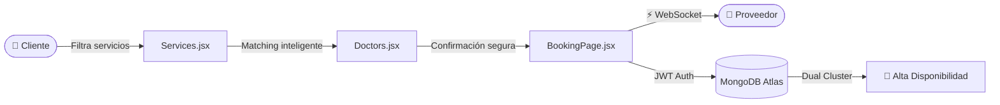
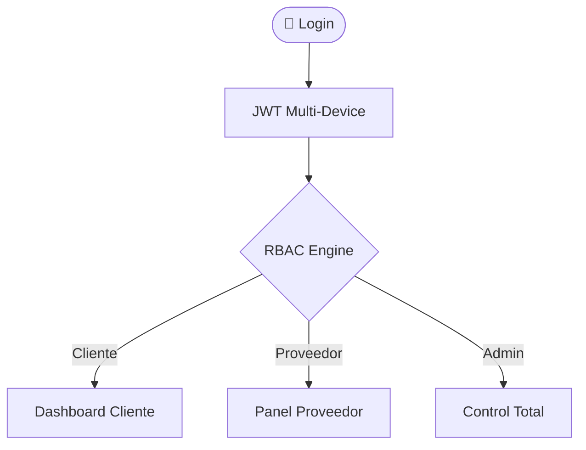

<div align="center">

<!-- ANIMATED HEADER -->


<!-- BADGES -->
<p align="center">
  
  
  
  
</p>

<p align="center">
  
  
  
  
</p>

<br/>

> **Software DT** — Un ecosistema digital de clase mundial diseñado y desarrollado en Bogotá, Colombia.
> Plataforma Full-Stack de nivel empresarial que conecta proveedores de servicios con clientes a través de una arquitectura de booking escalable, segura y de alto rendimiento.

<br/>

---

</div>

## 🏗️ Arquitectura del Proyecto — Monorepo

```text
SoftwareDT/                     ← Monorepo Root
├── client/                     ← Frontend (React + Vite + Tailwind CSS)
│   ├── src/
│   │   ├── components/         ← UI Atómicos & Componentes Reutilizables
│   │   ├── pages/              ← Services → Doctors → Booking → Communications
│   │   ├── hooks/              ← Custom Hooks & WebSocket Listeners
│   │   ├── store/              ← Estado Global (Zustand)
│   │   └── assets/             ← Estilos Globales & Brand Identity (Gainsboro)
│   ├── tailwind.config.js
│   └── package.json
│
├── server/                     ← Backend (Node.js + Express + MongoDB Atlas)
│   ├── src/
│   │   ├── models/             ← Mongoose Schemas (Users, Bookings, Services)
│   │   ├── routes/             ← RESTful API Endpoints Protegidos
│   │   ├── controllers/        ← Business Logic & Auth Controllers
│   │   ├── sockets/            ← Socket.io — Sincronización en Tiempo Real
│   │   └── config/             ← Database & Cloud Connections
│   ├── .env.example
│   └── package.json
│
├── docker-compose.yml          ← Orquestación Dev/Prod
└── README.md
```

---

## ✨ Flujo Técnico Principal



---

## 🔐 Seguridad & Control de Acceso



---

## ⚡ Features del Dashboard Interno

<div align="center">

| Módulo | Descripción | Tecnología |
|:---|:---|:---:|
| 📅 **Booking Manager** | Tracking en tiempo real: Activo → En Progreso → Completado | Socket.io |
| 📜 **Historial** | Archivo centralizado para auditoría y re-booking | MongoDB |
| 🔄 **Live Status** | UI se actualiza automáticamente sin recargar | WebSockets |
| 💬 **Chat en Tiempo Real** | Canal directo cliente ↔ proveedor baja latencia | Socket.io |
| 🗂️ **Historial de Mensajes** | Persistencia de conversaciones para control de calidad | MongoDB |
| 🎛️ **HUD Interactivo** | Botones de acción rápida e historial de soporte | React |

</div>

---

## 🛠️ Stack Tecnológico

<div align="center">

| Capa | Tecnologías | Enfoque |
|:---|:---|:---|
| 🎨 **Frontend** | React • Vite • Tailwind CSS | SPA optimizada con el New React Compiler |
| ⚙️ **Backend** | Node.js • Express | Clean Architecture & RESTful API Escalable |
| ⚡ **Real-Time** | Socket.io (WebSockets) | Sincronización instantánea de bookings y mensajes |
