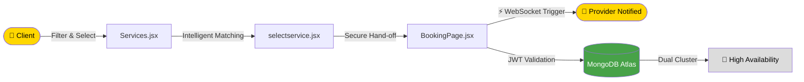
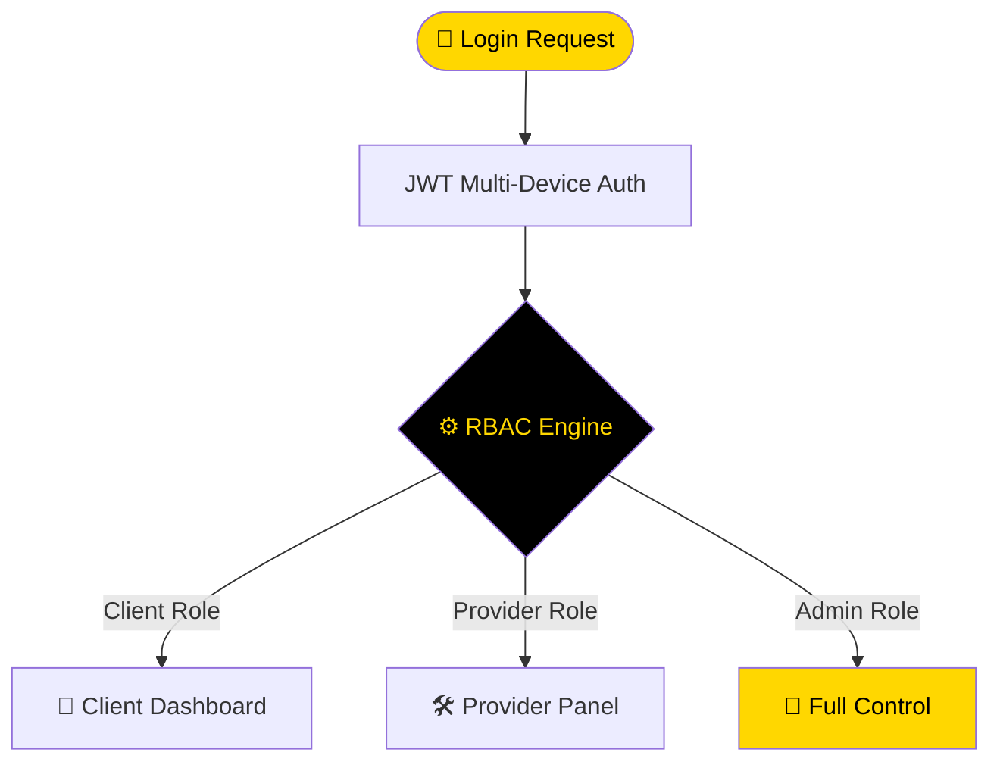

<div align="center">


<p align="center">
  
  
  
  
</p>

<p align="center">
  
  
  
  
  
  
</p>

<br/>

> **Software DT** is a digital ecosystem designed and developed in Bogotá, Colombia.
> A professional-level Full-Stack **MERN** solution engineered to connect service providers and clients
> through a scalable, secure, and high-performance booking architecture.
>
> *Inspired by the technical — modular, robust, production-ready.*

<br/>

</div>

---

## 🏗️ Project Architecture & Monorepo Structure

```text
SoftwareDT/                     ← Monorepo Root
├── client/                     ← Frontend (React + Vite + Tailwind CSS)
│   ├── src/
│   │   ├── components/         ← Reusable UI & Atomic Components
│   │   ├── pages/              ← Services → Doctors → Booking → Communications
│   │   ├── hooks/              ← Custom React Hooks & WebSocket Listeners
│   │   ├── store/              ← Global State Management (Zustand)
│   │   └── assets/             ← Global Styles & Brand Identity (Gainsboro Theme)
│   ├── tailwind.config.js
│   └── package.json
│
├── server/                     ← Backend (Node.js + Express + MongoDB Atlas)
│   ├── src/
│   │   ├── models/             ← Mongoose Schemas (Users, Bookings, Services)
│   │   ├── routes/             ← Protected RESTful API Endpoints
│   │   ├── controllers/        ← Business Logic & Auth Controllers
│   │   ├── sockets/            ← Socket.io Logic for Real-Time Updates
│   │   └── config/             ← Database & Cloud Connections
│   ├── .env.example
│   └── package.json
│
├── docker-compose.yml          ← Orchestration for Dev/Prod Environments
└── README.md                   ← Engineering Documentation
```

---

## 🚀 Engineering Excellence & Vision

```text
╔══════════════════════════════════════════════════════════════════╗
║                                                                  ║
║   "Every line of code is optimized for performance              ║
║    and security. Production-ready by default."                  ║
║                                                                  ║
║                                   — NietoDeveloper Standard     ║
╚══════════════════════════════════════════════════════════════════╝
```

- 🏆 **NietoDeveloper Standard** — Built under the philosophy of the **#1 Committer in Colombia**. Every line of code is optimized for performance and security.
- 🌐 **Scalable Infrastructure** — Hybrid approach with MongoDB Atlas **(Dual Cluster Strategy)** for maximum uptime.
- 🎯 **Global Reference** — Developed with elite technical standards to serve as a global benchmark for high-level software engineering.
- ⚡ **Production-Ready** — Manages real-world workflows for active booking services with zero downtime and real-time synchronization.

---

## ✨ Core Features & Technical Flow

### 🔄 Intelligent Booking & Service Logic



- **Service Selection** — Users filter and choose specialized services in `Services.jsx`
- **Provider Matching** — Data is contextually transferred to `.jsx` to match with specialists
- **Finalization** — Secure hand-off to `BookingPage.jsx` for appointment confirmation and real-time validation
- **Automation** — Once a service is booked, the system triggers instant notifications via WebSockets to the provider

---

### 🔐 Security & RBAC



- **JWT Authentication** — Advanced multi-device session management strategy
- **Role-Based Access Control (RBAC)** — Differentiated interfaces and permissions for Clients and Service Providers/Admins

---

## 🖥️ Internal Client Control Panel

> Software DT provides a high-end Internal Dashboard where users manage their digital interactions **in real-time without refreshing the browser**, powered by Socket.io.

<div align="center">

| Module | Description | Tech |
|:---|:---|:---:|
| 📅 **Booking Management** | Track **Active → In-Progress → Completed** appointments instantly | Socket.io |
| 📜 **Appointment History** | Centralized archive for audit, reviews, and re-booking | MongoDB |
| 🔄 **Instant Status Updates** | UI updates automatically when a provider changes service status | WebSockets |
| 💬 **Real-Time Chat** | Direct low-latency communication between clients and providers | Socket.io |
| 🗂️ **Messaging History** | Persistent storage of conversations for service quality tracking | MongoDB |
| 🎛️ **Interactive HUD** | Quick-action buttons for common inquiries and support history | React |

</div>

---

## 🛠️ The Professional Stack

<div align="center">

| Layer | Technologies | Engineering Focus |
|:---|:---|:---|
| 🎨 **Frontend** | React • Vite • Tailwind CSS | Optimized SPA with the New React Compiler |
| ⚙️ **Backend** | Node.js • Express | Clean Architecture & Scalable RESTful API Design |
| ⚡ **Real-Time** | Socket.io (WebSockets) | Instant data sync for bookings and messages |
| 🗄️ **Database** | MongoDB Atlas | Dual Cluster Architecture for High Availability |
| 🧠 **State** | Zustand | Lightweight and performant global state management |
| 🐳 **Infrastructure** | Docker Compose | Consistent development and production environments |

</div>

---

## 🎨 Official Design System — Software DT Style

> The visual identity follows a **corporate, minimalist aesthetic** defined by our custom Tailwind configuration:

```javascript
/** @type {import('tailwindcss').Config} */
export default {
  theme: {
    extend: {
      colors: {
        gainsboro:    "#DCDCDC",  // 🩶 Base Background — Corporate Minimalism
        gold:         "#FFD700",  // 🟡 Primary Accent — Brand Identity
        yellowColor:  "#FEB60D",  // 🟠 Secondary Accent
        headingColor: "#000000",  // ⚫ Main Typography
        textColor:    "#000000",  // ⚫ Body Text
      },
      backgroundColor: {
        'main': '#DCDCDC',        // Global base background
        'card': '#FFFFFF',        // Cards and panels
      },
    },
  },
}
```

---

## 🔗 Leadership & Connectivity

<div align="center">

[](https://softwaredt.vercel.app)
[](https://github.com/NietoDeveloper)
[](https://committers.top/colombia)
[](https://committers.top)

<br/>

*Software DT is a flagship project by* **NietoDeveloper — Manuel Nieto**

*Developed with technical rigor to be the best in Colombia.*

📍 Bogotá, Colombia 🇨🇴

</div>

---

<div align="center">

</div>
